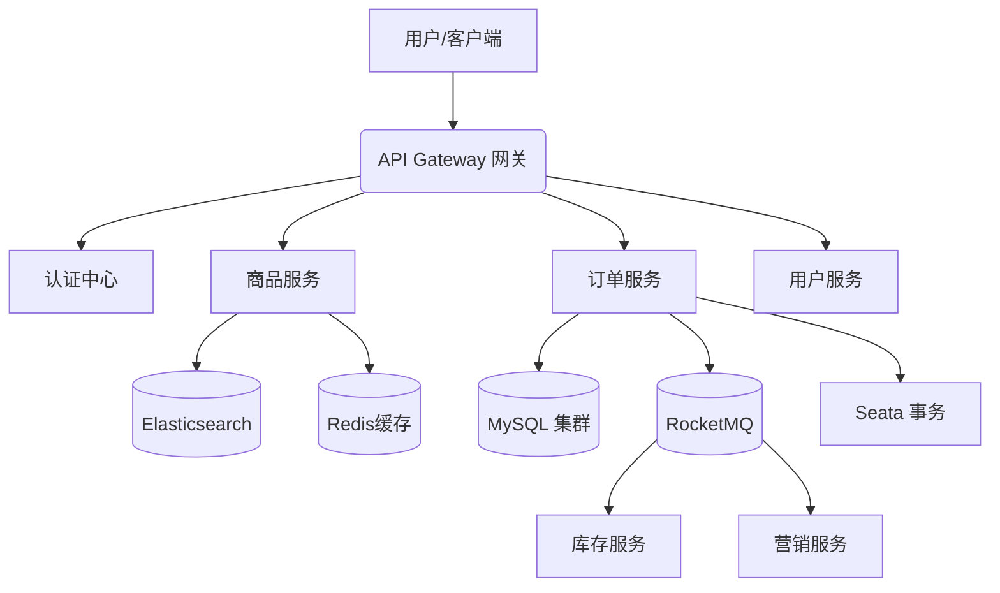

<div align="center">
  <h1>🛍️ E-Commerce Platform</h1>
  
  <p>
    <strong>基于 Spring Boot + Vue 3 的现代化微服务电商系统</strong>
  </p>
  
  <p>
    
    
    
    
    <a href="./LICENSE.txt">
        
    </a>
  </p>
</div>

## 📖 项目简介

**E-Commerce Platform** 是一款基于 **Spring Boot + Vue3** 的现代化分布式电商平台。

本项目采用前后端分离架构，后端基于 Spring Cloud Alibaba 微服务生态，前端采用 Vue3 + TypeScript + Element Plus。系统专注于解决电商业务中的高并发、分布式事务及海量数据检索问题，提供从商品管理、订单处理到支付结算的完整闭环解决方案。

### ✨ 核心特性

* **微服务架构**：基于 Nacos、Sentinel、Seata 构建的高可用微服务集群。
* **高性能并发**：利用 Redis + Redisson 实现分布式锁与缓存，轻松应对秒杀场景。
* **全文检索**：集成 Elasticsearch 实现毫秒级商品搜索与聚合分析。
* **现代前端**：Vue3 Composition API + Vite 极速构建，提供极致的用户体验。
* **容器化部署**：支持 Docker + Kubernetes 部署，集成 Prometheus 监控体系。

---

## 🏗 代码结构

```text
E-Commerce-Platform
├── ElectronicMallApi          // 后端工程 (Java)
│   ├── mall-admin             // 后台管理服务
│   ├── mall-auth              // 认证中心 (Oauth2)
│   ├── mall-gateway           // 服务网关
│   ├── mall-order             // 订单服务 (Seata, RocketMQ)
│   ├── mall-product           // 商品服务 (Elasticsearch)
│   ├── mall-user              // 用户服务
│   └── mall-ware              // 库存服务
├── ElectronicMallVue          // 前端工程 (Vue3)
│   ├── src
│   │   ├── api                // 接口封装
│   │   ├── views              // 页面组件
│   │   └── store              // 状态管理 (Pinia)
├── node                       // Node.js 相关脚本或服务
├── demo.sql                   // 初始化 SQL 脚本
└── LICENSE.txt                // 开源协议
````

-----

## 🛠 技术栈

### 后端技术 (Backend)

| 组件 | 版本 | 说明 |
| :--- | :--- | :--- |
| **Spring Cloud Alibaba** | 2021.x | 微服务全家桶 (Nacos, Sentinel, Seata) |
| **Spring Boot** | 2.7.x | 基础框架 |
| **MyBatis Plus** | 3.5.x | ORM 框架 |
| **Redis & Redisson** | 6.x | 缓存与分布式锁 |
| **Elasticsearch** | 7.x/8.x | 搜索引擎 |
| **RocketMQ** | 4.x/5.x | 消息队列 |
| **ShardingSphere** | 5.x | 分库分表 |

### 前端技术 (Frontend)

| 组件 | 版本 | 说明 |
| :--- | :--- | :--- |
| **Vue** | 3.x | 核心框架 (Composition API) |
| **Vite** | 4.x | 构建工具 |
| **TypeScript** | 4.x | 静态类型支持 |
| **Element Plus** | 2.x | UI 组件库 |
| **Pinia** | 2.x | 状态管理 |
| **ECharts** | 5.x | 数据可视化 |

-----

## 🚀 快速启动

### 1\. 环境准备

确保本地环境满足以下要求：

  * **JDK**: 1.8 或 11
  * **Maven**: 3.6+
  * **Node.js**: 16+
  * **MySQL**: 5.7+
  * **Redis**: 5.0+
  * **Nacos**: 2.x

### 2\. 后端启动

1.  **数据库初始化**：创建一个名为 `mall_db` (或根据配置) 的数据库，并导入项目根目录下的 `demo.sql`。
2.  **配置中心**：启动 Nacos，将各模块的 `application.yml` 配置导入 Nacos 配置中心，并修改 MySQL、Redis 连接信息。
3.  **启动服务**：
    ```bash
    cd ElectronicMallApi
    # 建议IDE中运行，或使用Maven命令
    mvn clean package -DskipTests
    java -jar mall-gateway/target/mall-gateway.jar
    # 依次启动其他微服务...
    ```

### 3\. 前端启动

```bash
cd ElectronicMallVue

# 安装依赖
npm install

# 启动开发服务器
npm run dev
```

访问地址：`http://localhost:3000` (具体端口见控制台输出)

-----

## 📐 系统架构图



> *注：上图展示了核心业务的数据流转逻辑。*

-----

## 🤝 贡献指南

1.  Fork 本仓库
2.  新建 Feat\_xxx 分支
3.  提交代码
4.  新建 Pull Request

## 📄 开源协议

本项目采用 [MIT License](https://www.google.com/search?q=LICENSE.txt) 协议。
